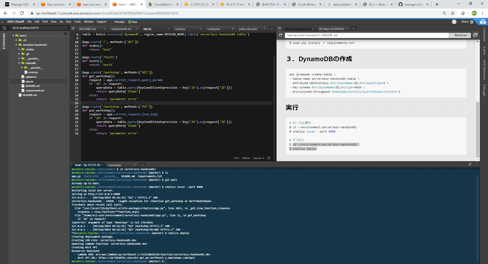

# サーバレスハンズオン

## １．cloud9の設定
``` bash
$ sed -i -e s/python27/python37/g ~/.bashrc

$ source ~/.bashrc

$ sudo update-alternatives --config python
  # 「2」を入力して、Enter
  
$ sed -i -e s/aws_/#aws_/g ~/.aws/credentials
  #下記の確認モーダルが表示されるので、「Cancel」を選択
  #Could not update credentials

  #下記の確認モーダルが表示されるので、「Permanently disable」を選択
  #Unable to update credentials
```


## ２．必要なライブラリのインストール
``` bash
$ cd ~/environment/serverless-handson01
$ sudo pip install -r requirements.txt
```


## ３．DynamoDBの作成
``` bash
aws dynamodb create-table \
--table-name serverless-handson01-table \
--attribute-definitions AttributeName=ID,AttributeType=S \
--key-schema AttributeName=ID,KeyType=HASH \
--provisioned-throughput ReadCapacityUnits=1,WriteCapacityUnits=1
```


## 実行
``` bash
# ローカル実行
$ cd ~/environment/serverless-handson01/
$ chalice local --port 8080

# デプロイ
$ cd ~/environment/serverless-handson01/
$ chalice deploy
```
